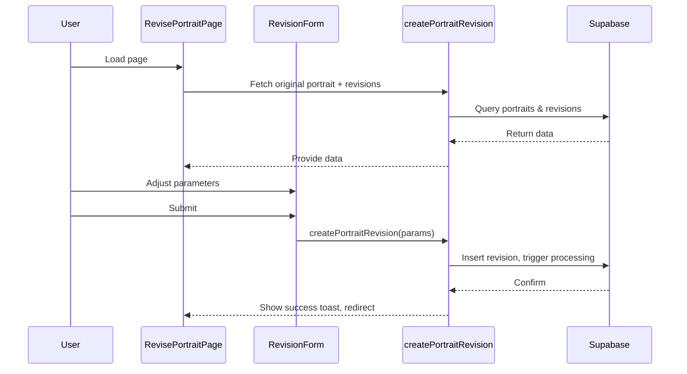

# Portrait Revision Interface

## Overview
The Portrait Revision Interface allows users to adjust and refine pet portraits using interactive controls, view history of revisions, and compare versions before submitting final changes.

## Getting Started
1. Install dependencies:
   ```bash
   npm install
   ```
2. Run the development server:
   ```bash
   npm run dev
   ```
3. Open the revision page in your browser:
   `http://localhost:3000/portraits/{portraitId}/revise`
4. Run unit tests:
   ```bash
   npm test
   ```
5. Open end-to-end tests (Cypress):
   ```bash
   npx cypress open
   ```

## Architecture Overview



## Component API

### RevisePortraitPage (`src/app/portraits/[portraitId]/revise/page.tsx`)
- **Purpose**: Container for image display, version comparison, and revision form.
- **Key Hooks & State**:
  - `usePortraitRevisionHistory()` → `{ past, present, future, undo, redo, setPresentVersion }`
  - Fetch functions: `getPortrait`, `getPortraitRevisions`
- **Layout Components**: `Container`, `Grid`, `Flex` from `src/components/ui`

### RevisionForm (`src/components/revision/RevisionForm.tsx`)
- **Props**:
  - `currentParameters: Partial<PortraitParameters>`
  - `onParameterChange(key: keyof PortraitParameters, value: string|number|boolean|string[])`
  - `onSubmit(parameters: PortraitParameters): Promise<void>`
- **Behavior**: Validates required fields, submits to `createPortraitRevision`, shows toasts, and redirects on success.

### Visualization Components
- `ZoomablePreviewDisplay` (`src/components/ui/zoomable-preview-display.tsx`)
  - Renders an image with pan/zoom controls.
- `RevisionHistory` (`src/components/revision/RevisionHistory.tsx`)
  - Displays past/future versions with undo/redo buttons.
- `RevisionComparer` (`src/components/revision/RevisionComparer.tsx`)
  - Offers side-by-side and overlay comparison modes.

## State Management

We use the custom hook `usePortraitRevisionHistory`:
```ts
const {
  past,
  present,
  future,
  setInitialHistory,
  addVersion,
  setPresentVersion,
  undo,
  redo,
  canUndo,
  canRedo
} = usePortraitRevisionHistory();
```
- **Initialization**: `setInitialHistory(originalPortrait, revisions)`
- **Branching**: New revisions via `addVersion` clear future history
- **Navigation**: `undo()` / `redo()`, or jump with `setPresentVersion(id)`

## Troubleshooting & FAQs

### API & Environment
- Ensure `.env.local` contains:
  ```ini
  NEXT_PUBLIC_SUPABASE_URL=<your-url>
  NEXT_PUBLIC_SUPABASE_ANON_KEY=<your-key>
  OPENAI_API_KEY=<your-openai-key>
  ```
- Verify Supabase schema matches `PortraitRevision` interface.

### Testing
- Jest globals (`expect`, `.toBe()`) are enabled via `plugin:jest/recommended` in `.eslintrc.json`.
- Mocking Supabase: add mocks in `jest.setup.js` or use `jest.mock()` inside tests.
- E2E: Cypress tests live in `cypress/e2e/portrait-revision.cy.ts` (create if needed).

### Common Errors
- **Validation failure**: Check required parameters (`artStyle`, `background`, `orientation`, `styleIntensity`).
- **Network errors**: Verify CORS settings and environment variables.
- **Type errors**: Confirm `customization_params` shape matches `PortraitParameters`.

## User Guide

1. **Select Version**: Use history panel to navigate past and future versions.
2. **Adjust Parameters**: Use sliders and dropdowns to modify style, background, accessories, etc.
3. **Compare Versions**: Toggle between side-by-side or overlay comparison modes.
4. **Submit Revision**: Click "Submit" to save your changes. A toast will confirm success, then redirect.
5. **Undo/Redo**: Use Undo/Redo buttons for non-destructive editing.

---
*Last updated: 2025-05-11* 