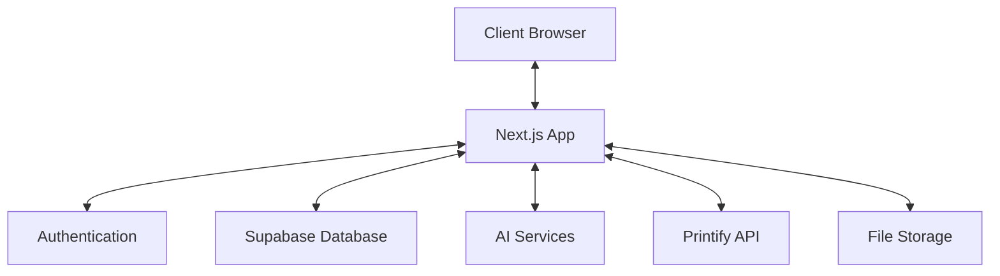

# System Patterns

## Architecture Overview
CanvaPet follows a modern web application architecture with Next.js at its core, utilizing the App Router for both static and server-rendered components.

## Key Design Patterns

### Component Structure
- **Page Components**: Main page containers in the app directory
- **UI Components**: Reusable UI elements in the components directory
- **Feature Components**: Feature-specific components organized by domain
- **Layout Components**: Shared layouts for consistent UI structure

### State Management
- **React Context**: For global state and user information
- **Server Components**: For data fetching and initial state
- **Client Components**: For interactive elements and local state
- **Zustand Stores**: For complex state management across components

### Data Flow
- **Server Actions**: For secure database interactions
- **API Routes**: For third-party service integration
- **Database Queries**: Direct Supabase interactions for data retrieval
- **File Uploads**: For handling pet images and customization assets

### Authentication Flow
- Supabase Authentication for user management
- Protected routes with middleware
- Role-based access control for admin functions

### Pet Customization System
- Component-based layering for pet appearance
- Canvas rendering for real-time preview
- Serializable configuration for saving and loading

### AI Integration
- API-based integration with AI services
- Image processing pipeline for pet uploads
- Portrait generation based on customized pets

### E-commerce Integration
- Product catalog synchronization with Printify
- Order creation and tracking
- Payment processing with secure checkout

## Code Organization
- `/app`: Next.js app router pages and layouts
- `/components`: Reusable UI components
- `/lib`: Utility functions and service integrations
- `/contexts`: React context providers
- `/stores`: Zustand state stores
- `/types`: TypeScript type definitions

## Data Models
Key entities in the system include:
- Users
- Pets
- Customizations
- Portraits
- Products
- Orders
- Payments 